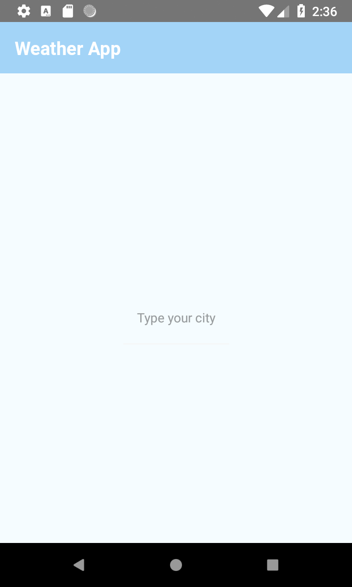
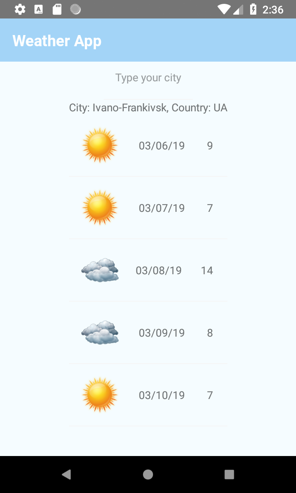
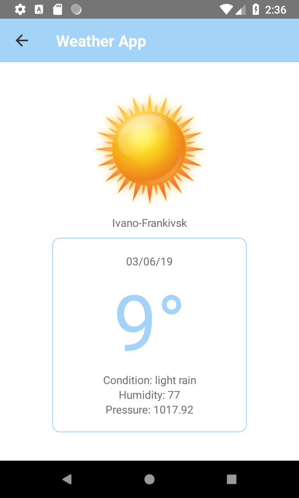

# Weather-RN-Realm

This app getting weather by city.

Technologies, elements and libraries used when writing an application:
JavaScript, React Native, Redux, Redux Thunk, Navigation, Realm Database.

## View
<table align="left" width="100%">
  <tbody>
      <td colspan="1">  </td>
      <td colspan="2">  </td>
      <td colspan="3">  </td>
  </tbody>
</table>

## Version
0.01

## How to install
1) Download project from git.
2) Connect your device to the computer or use the emulator.
3) Download and install Node.js (https://nodejs.org/en/download/)
2) Open Command Line in the project directory and run:
#### `npm install -g react-native-cli`
#### `react-native run-android`
